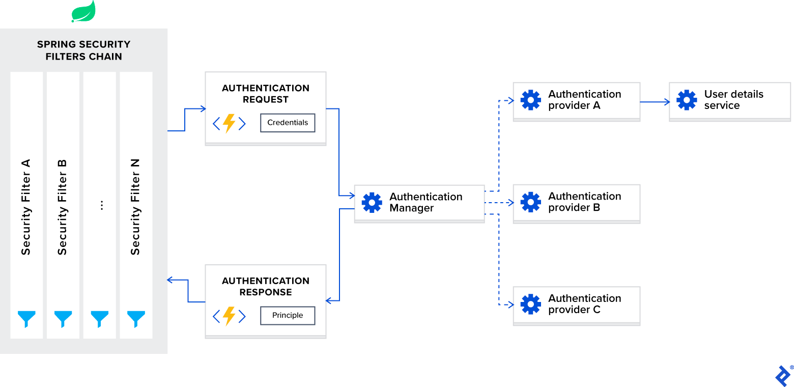
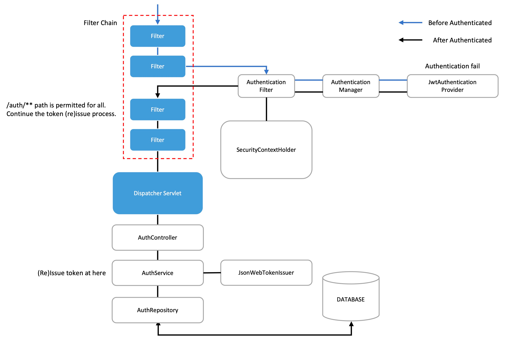

## Defining terminology
- Authentication
  - process of verifying the identity of a user
  - 로그인 과정에서 ID/PW를 제공하여, 'Who are you'에 대한 질문을 답하는 것.
- Authorization
  - process of determining if a user has proper permission
  - 특정 유저의 접근/읽기 등의 권한을 확인하는 것
- Principle
  - 현재 인증된 유저
- Granted authority
  - 인증된 유저에 대한 권한
- Role
  - 권한들의 묶음

## Creating a Basic Spring Application
- Artifacts에 'spring-boot-starter-security'가 추가되어 있다면, http://localhost:8080에 진입했을 때 /login으로 리다이렉트 된다.
  - Default username : user
  - Default password : 콘솔 로그를 확인한다.

  ```yaml
  Using generated security password: 1fc15145-dfee-4bec-a009-e32ca21c77ce
  ```
  
  - 로그아웃 하고 싶으면 http://localhost:8080/logout 에 접근한다.

## Spring Security Architecture Overview

- Spring Security Filters Chain
  - 스프링 시큐리티 프레임워크를 사용하면, 자동으로 필터 체인이 등록된다. 이들은 들어오는 사용자 요청을 인터셉트한다.
  - URL의 접근 권한이 public인지, 유저의 인증/인가 상태는 어떠한지 등을 확인한다.
  - 스프링 시큐리티 필터가 가장 먼저 invoke되며, 커스텀 필터를 먼저 invoke 하고 싶다면 application.yml의 configuration을 수정해야 한다.
  - 아래는 10개의 커스텀 필터를 위한 공간을 스프링 필터 앞단에 설정하는 방법이다.
    ```yaml
    spring.security.filter.order=10
    ```

- AuthenticationProvider
  - 특정 타입의 Authentication을 처리한다. 두 가지의 메서드를 가지는 인터페이스이다.
    - `authenticate` : 요청에 대한 authentication 수행 
    - `supports` : provider가 특정 authentication type을 지원하는지 체크

- AuthenticationManager
  - 여러 Provider가 있을 때, Request type을 바탕으로 적절한 provider에게 넘겨주는 중재자 역할
  - 이 프로젝트에서는 `DaoAuthenticationProvider`라는 구현체를 사용하는데,`UserDetailsService`에서 사용자 정보를 검색해주는 역할이다. 


- UserDetailsService
  - User-specific data loading
  - 예를 들면, loadUserByUsername은 사용자 이름으로 User detail을 불러온다.

## Authentication Using JWT with Spring Security

